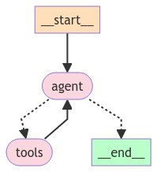

# Agentic AI

Agentic AI examples for demoing in OpenShift AI

## What is an Agentic AI?

Asking to our LLM an Agentic AI is the following: 

    "Agentic AI, also known as autonomous AI or self-governing AI, refers to artificial intelligence systems that can initiate actions and make decisions independently, without human intervention or supervision. These systems have the ability to learn from their environment and adapt to new situations, often with the goal of achieving specific objectives or goals. Agentic AI systems can be found in various applications, such as autonomous vehicles, drones, and home automation systems. They are designed to operate in complex and dynamic environments and can make decisions based on their own analysis of data and situations. However, it's important to note that the development and deployment of agentic AI systems require careful consideration of ethical, legal, and safety issues"

## Demos

* [Agentic AI using LangGraph to build a Agentic Chatbot](./agentic-ai-examples/agentic-ai-langgraph.ipynb)

